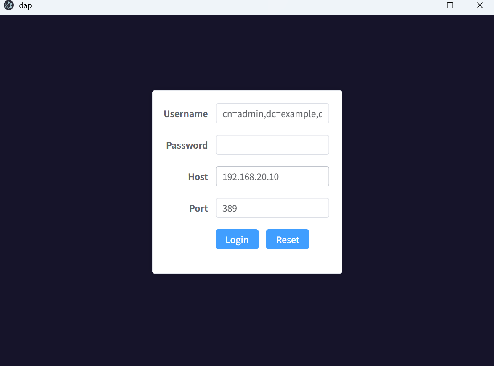

LDAP GUI manager


```shell
# node version
22.14.0

# build package (support windows only)
npm run build

# clean
npm run clean

```

项目如下：




### feature to add

1. user profile
2. tls/ssl
3. display objectClass definition
4. export objectClass
5. add new objectClass


